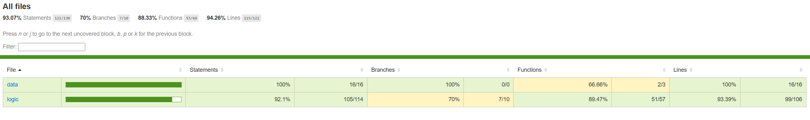

# Red Social

**Intro**  
Este es mi primer proyecto para aprender sobre desarrollo web. Es una aplicación web que permite a los usuarios registrarse, iniciar sesión, crear publicaciones, interactuar con las publicaciones de otros usuarios, y mucho más. Está diseñada para ser una plataforma sencilla y dinámica para conectar personas a través de contenido compartido. Además, está diseñada con TailwindCSS al estilo cómic para darle un toque visual único.

El objetivo principal del proyecto es proporcionar un lugar donde los usuarios puedan compartir sus pensamientos, intereses y conectar con otras personas de manera fácil y divertida.

---

### **Functional**

Esta aplicación permite a los usuarios:

- Crear una cuenta e iniciar sesión con autenticación segura.
- Crear nuevas publicaciones con texto y/o imágenes.
- Modificar las publicaciones existentes.
- Eliminar publicaciones que ya no deseen compartir.
- Dar "me gusta" a publicaciones de otros usuarios.
- Ver publicaciones de otros usuarios y su actividad.

---

### **Use Cases**

**User**  
Los usuarios pueden:

- Registrar una cuenta
- Iniciar sesión
- Publicar contenido
- Modificar sus publicaciones
- Eliminar publicaciones
- Marcar publicaciones con "like"
- Ver publicaciones de otros usuarios
- Ver las publicaciones que han dado "me gusta"

---

### **Technical**

#### **Blocks**

- **App**
- **API**
- **DB**

---

#### **Packages**

**Frontend**:

- React
- TailwindCSS
- Vite

**Backend**:

- Express
- JWT
- bcrypt
- Mongoose
- MongoDB

---

#### **Data Model**

**User**:

- `id` (string, uuid)
- `name` (string, min length 1, max length 20)
- `email` (string, max length 30)
- `username` (string, min length 3, max length 20)
- `password` (string, min length 8, max length 20)
- `createdAt` (Date)
- `modifiedAt` (Date)

**Post**:

- `id` (string, uuid)
- `author` (User.id)
- `image` (string, max length 1000)
- `content` (string, max length 2000)
- `createdAt` (Date)
- `modifiedAt` (Date)
- `likes` ([User.id])

---

### **Technologies**

- **HTML / Tailwind / JS**
- **React / Vite**
- **Express / Node**
- **MongoDB / Mongoose**
- **Autenticación y seguridad:**
  - JWT (JSON Web Token)
  - bcrypt

---

### **Code Coverage**

La cobertura de pruebas de la aplicación cubre las funcionalidades principales, incluyendo:

- Pruebas de autenticación de usuarios.
- Pruebas de la creación, modificación y eliminación de publicaciones.
- Pruebas de la funcionalidad de likes.

---

### **Planning**

[feature/product #63](https://github.com/b00tc4mp/isdi-bootcamp-202501/pull/63)

